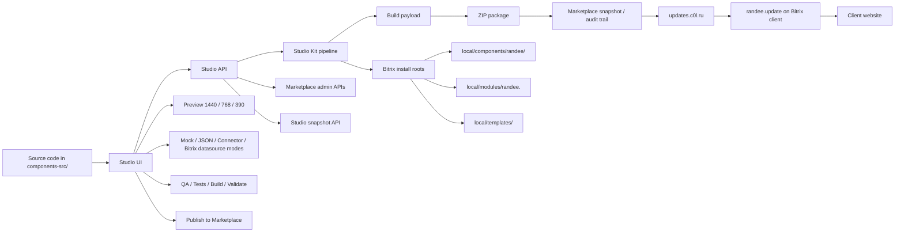

# Randee Component Studio Architecture

## Purpose

This document shows the current execution path for the Randee Studio ecosystem:

- code-first component development;
- local preview in Studio;
- package generation;
- marketplace publish;
- Bitrix client updates through `randee.update`.

## High-Level Flow



## Runtime Layers

### 1. Studio App

`apps/studio` is the developer cockpit.

It owns:

- artifact navigation;
- preview rendering;
- data source switching;
- QA controls;
- Marketplace history panel;
- publish trigger.

### 2. Studio API

`apps/api` is the server boundary.

It owns:

- `POST /api/studio/publish`;
- `POST /api/studio/test`;
- `POST /api/studio/build`;
- `POST /api/studio/package`;
- `POST /api/studio/validate`;
- `GET /api/studio/marketplace`;
- admin endpoints for products, packages, releases, and uploads.

### 3. Studio Kit

`packages/studio-kit` is the shared pipeline library.

It owns:

- build and payload layout;
- ZIP generation;
- package validation;
- marketplace store persistence;
- publish orchestration;
- audit trail writes.

### 4. Marketplace State

Marketplace state is stored locally during development in:

```text
.studio/marketplace/
```

The structure tracks:

- products;
- packages;
- releases;
- publish audits;
- uploaded ZIPs.

### 5. Bitrix Client

`randee.update` consumes marketplace releases.

It validates packages, downloads ZIPs, and installs only the `payload/` tree into Bitrix filesystem roots.

## Contract Boundaries

### Studio does

- code editing and preview orchestration;
- build/test/package/validate/publish requests;
- QA hint surface;
- history visualization.

### Marketplace does

- product/package/release records;
- ZIP upload handling;
- publication state;
- API token protection on admin routes.

### `randee.update` does

- downloads releases;
- validates ZIP payloads;
- installs content into Bitrix;
- maintains rollback safety.

## Current Gaps

- real Bitrix Connector transport is still mocked at the Studio layer;
- dedicated scaffold templates for `module` and `template` are not yet added;
- CI/CD is not wired yet.

